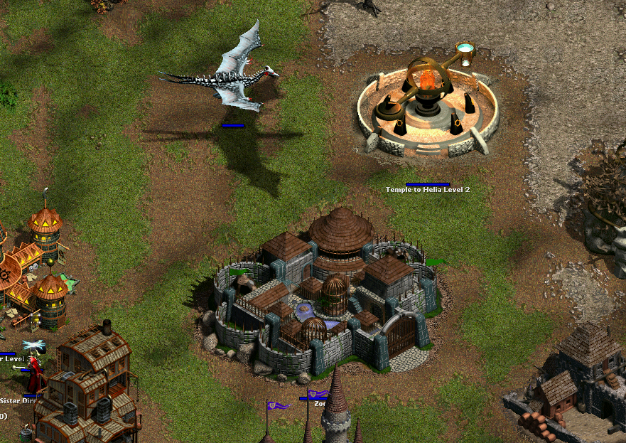
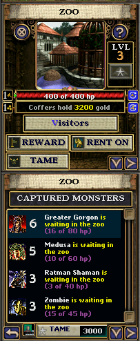
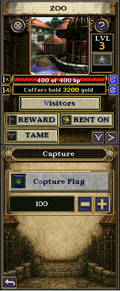

# Restore Abandoned Zoo

Restore Abandoned Zoo completes the unused three-level Zoo left in *Majesty
Gold HD* and turns it into a full monster-capture and kingdom-defense system.
Place Capture Flags on hostile monsters, bring successful captures back alive,
display them as Zoo visitors, earn admission revenue, or release them as
friendly guardians.

The mod supports Original Majesty and Northern Expansion content and handles
ordinary and custom monsters generically rather than maintaining a
monster-by-monster compatibility table.



## Features

- A buildable, upgradeable three-level Zoo using restored stock building art
- Private Capture Flags that can be placed only on eligible hostile monsters
- Stock Zoo capture odds based on reward value and monster maximum health
- Visitor capacities of 4, 6, and 8 at Zoo levels 1, 2, and 3
- Monster visitor rows with icons, names, health, activity, and Threat Rank
- Zoo revenue of 40 gold per Threat Rank per stored monster each minute
- A 5 percent per-minute breakout risk for each captive
- Full hostile release when the Zoo is destroyed, but no release from ordinary
  building damage
- **Tame Beast**, which releases a selected captive as a Palace guardian for
  500 gold per Threat Rank
- Optional hero rentals: after ordinary shopping, a wealthy hero can rent a
  captive follower for 100 gold per Threat Rank
- Separate Zoo-themed primary, Capture, and Tame interfaces plus private flag,
  button, cursor, and minimap art
- Save-game compatibility for games in which the Zoo has not yet been built

| Captured monsters and Tame Beast | Private Capture Flag panel |
| --- | --- |
|  |  |

## Threat Rank

Threat Rank is a generic 1-8 strength estimate derived from the monster's stock
`LevelXP` bounty. It is used by visitor rows, admission revenue, taming prices,
and hero rental prices.

| Rank | Stock `LevelXP` |
| ---: | ---: |
| 1 | 230 or less |
| 2 | 231-400 |
| 3 | 401-500 |
| 4 | 501-900 |
| 5 | 901-1,500 |
| 6 | 1,501-2,000 |
| 7 | 2,001-3,500 |
| 8 | More than 3,500 |

These bands approximate evenly populated groups in the shipped monster data.

### Custom monster support

A custom monster needs the normal monster classification and stock-style
behavior fields. Its character description should provide a positive
`<Experience value="..."/>`; Majesty exposes that as `LevelXP`, which assigns
the Threat Rank without a title-specific table.

Visitor icons use Majesty's stock `IX92` / `IX94` monster resolver. A custom
icon therefore requires:

1. A 25x25 indexed interface frame compatible with Majesty's interface palette.
2. An `IX92` or `IX94` entry keyed to the monster's exact four-character unit
   description ID.
3. The new tile plus the complete updated positional TILE table from the same
   interface atlas.

Map sprites, the large profile portrait, and `ImageIDBase` do not supply the
visitor-row icon. Preserve every stock atlas entry when adding a custom one;
Majesty Mod Manager can then compose compatible atlas additions without relying
on load order. The Zoo already supplies the complete stock atlas needed by
Original-rules quests.

## Requirements and installation

Restore Abandoned Zoo requires [Majesty Mod Manager](https://steamcommunity.com/sharedfiles/filedetails/?id=3793024054).
The manager supplies the generic runtime features needed by the Zoo and safely
combines it with other compatible mods.

1. Subscribe to Restore Abandoned Zoo and Majesty Mod Manager.
2. Run `Majesty Mod Manager.exe` from the manager's Workshop folder.
3. Select Restore Abandoned Zoo on the **Merge** tab.
4. Choose **Prepare Selected Mods**.
5. Launch the game through **Launch Majesty** in the manager.

Do not enable the raw Zoo Workshop package directly in Majesty's mod selector.
Do not rely on mod load order to combine it with other CAM mods.

## Gameplay notes

The stock capture formula is:

```text
capture chance = 50 * sqrt((reward / 20) / monster maximum HP)
```

The result is capped at 95 percent. A failed roll follows the monster's normal
death path. A successful roll interrupts death, charms the monster, and leaves
it available for heroes to escort to the Zoo.

Zoo capacity counts stored visitors plus monsters already latched to a hero for
delivery. Additional Capture Flags can be placed while unclaimed space remains.
The Zoo refuses duplicate flags on the same monster.

Capturing quest-critical monsters can prevent a quest event that expects that
monster's normal death callback. Use Capture Flags cautiously in scripted
quests.

## Compatibility

The package uses a stable schema-version-3 merge contract with private GPL,
dialog, flag, cursor, and art resources. It declares its required stock-shaped
runtime features rather than modifying the executable itself.

There is no required install or uninstall order. Let Majesty Mod Manager
prepare the selected set each time mods change.

## Building and validation

Building requires Python 3.9 or newer and a local Majesty Gold HD installation:

```powershell
python scripts/build_mod.py `
  --game-path "C:\Program Files (x86)\Steam\steamapps\common\Majesty HD"

python scripts/validate_mod.py dist/RestoreAbandonedZoo
```

The completed standalone source package is written to
`dist/RestoreAbandonedZoo`. `scripts/Install-LocalMod.ps1` can copy and verify
that package in the local Majesty mods directory for Mod Manager discovery.

## Repository layout

```text
assets/     Source and packed Zoo interface and Capture Flag artwork
scripts/    Deterministic package, art, validation, staging, and local-copy tools
src/        Merge manifest, semantic contract, GPL, data, and descriptions
WORKSHOP.md Steam Workshop description
```

The repository contains source and reproducible build tooling. Generated
packages and private development records are intentionally excluded.
